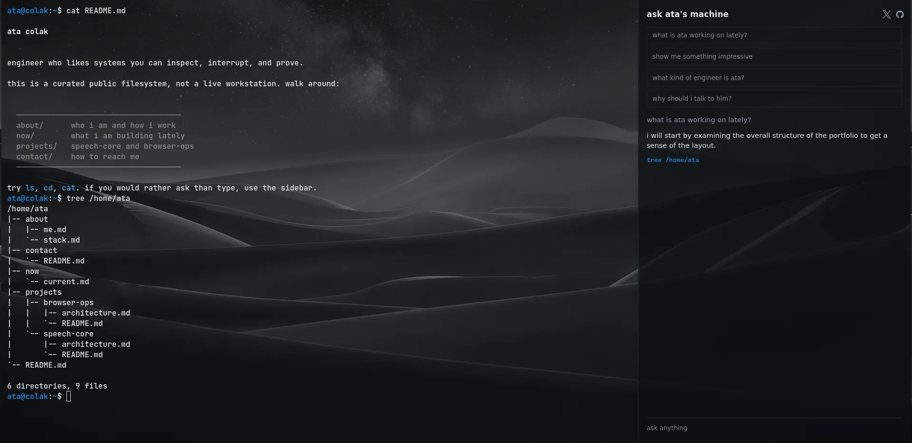

# colak.sh



a terminal-native public portfolio. a visitor and an agent share one browser-local shell. the terminal is the exhibit; chat is the mutter between glances.

live: [colak.sh](https://colak.sh)

## invariants

- the public terminal is not a host pty. no server `child_process`, no ssh, no host filesystem.
- human and agent share one `BashShell`. both go through `handleInput()`. do not `bash.exec()` as the agent path — that is a second cwd/history.
- the agent has one tool: `terminal_exec`. the browser runs it. the server only rendezvouses.
- model credentials stay on the server. never `VITE_*`.
- identity, origin, prompts, and socials live in `site.json`. wallpaper is `src/assets/wallpaper.jpg`. favicon is `public/favicon.png`. swap those, not the code.
- `projects/` is curated pamphlets, not github dumps. origin links go to the repo. `oh-my-pi.md` is contributions, not a checkout.

## make it yours

1. edit `site.json` (`user`, `home`, `origin`, `chatTitle`, `prompts`, `socials`).
2. replace `content/home/<user>/` with your files. keep a `README.md` at the home root if you want the opening `cat`.
3. replace `src/assets/wallpaper.jpg`.
4. put `LLM_BASE_URL`, `LLM_API_KEY`, `LLM_MODEL` in a local env file, never in git.

```bash
cp .env.example .env
pnpm install
FAKE_AGENT=1 pnpm exec tsx server/index.ts
pnpm dev:client
```

node 24. `pnpm test` / `pnpm typecheck` / `pnpm build`.

## credits

- [wterm](https://wterm.dev) (`@wterm/dom`, `@wterm/react`, `@wterm/just-bash`, `@wterm/markdown`) — terminal, markdown-to-ansi, shell adapter
- [just-bash](https://github.com/vercel-labs/just-bash) — in-memory bash
- [ai sdk](https://ai-sdk.dev) — model loop
- vite, react, ws, zod

## license

[CC BY-NC-SA 4.0](LICENSE). credit this project. non-commercial. share-alike.

wterm and just-bash remain apache-2.0; this repo's own code and curated content are cc by-nc-sa 4.0.
